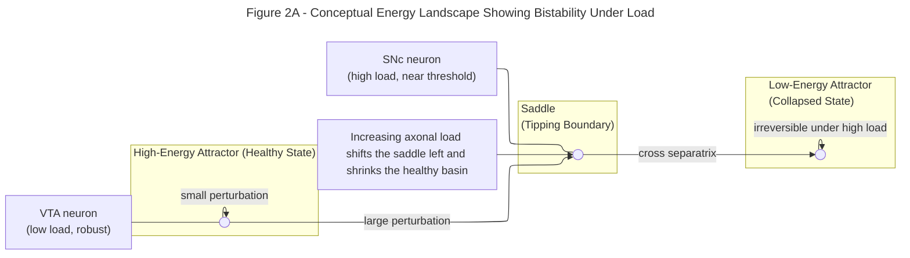

## A Load-Induced Energetic Tipping Point Explains Selective Vulnerability of Substantia Nigra Neurons

Max Anfilofyev
[max.anfilofyev@gmail.com](mailto:max.anfilofyev@gmail.com)

---

## **Abstract**

Dopaminergic neurons of the substantia nigra pars compacta (SNc) are selectively vulnerable in Parkinson’s disease, while closely related neurons in the ventral tegmental area (VTA) are comparatively spared. Although mitochondrial dysfunction, calcium stress, and α-synuclein aggregation have each been implicated, none alone explains why anatomically similar populations exhibit such different fates. Here we develop a **minimal two-variable energetic model** that captures only mitochondrial functional capacity, energetic reserve, and the combined load from axonal arborization and calcium handling. Despite its simplicity, the model reveals that increasing structural load deforms the energetic landscape until a **saddle-node bifurcation** emerges, producing coexisting healthy-energy and collapsed-energy states. SNc-like neurons, which bear extreme axonal and calcium-handling demands, reside **inside** this bistable regime, operating near a separatrix that renders them vulnerable to even modest metabolic perturbations. In contrast, VTA-like neurons lie **outside** the bistable window and robustly return to their high-energy state following similar disturbances. The model reproduces hallmark features of Parkinsonian degeneration—long periods of stability, sudden irreversible collapse, and population-specific susceptibility—using only the geometry of load-dependent energy regulation. These findings suggest that selective SNc vulnerability arises not from unique molecular defects, but from the **fundamental dynamical structure** imposed by their extraordinary anatomical and physiological load.

---

## **1. Introduction**

Parkinson’s disease is marked by the striking and selective degeneration of dopaminergic neurons in the substantia nigra pars compacta (SNc), while neighboring dopaminergic populations in the ventral tegmental area (VTA) remain largely preserved.[15–17](#references) This anatomical specificity has remained one of the field’s central puzzles. Multiple lines of evidence converge on a common theme: **SNc neurons carry exceptionally large structural and functional loads.** Their axonal arborizations span hundreds of thousands to millions of synapses, embedded in complex basal ganglia microcircuits, and their pacemaking physiology relies on Ca²⁺ entry that imposes substantial metabolic demand.[1–4,5–9,15,16](#references) These characteristics imply that SNc neurons operate close to the limits of energetic feasibility.[15–17](#references)

Despite extensive work on mitochondrial dysfunction, oxidative stress, dopamine oxidation, and α-synuclein aggregation, no single factor has fully explained why SNc neurons are so much more vulnerable than VTA neurons.[5–14,18–20,24](#references) Many existing models either include dozens of variables or focus on downstream pathology without addressing the fundamental question: *Why is the SNc neuron so close to a tipping point, while the VTA neuron is not?*[21–23](#references)

Here we propose a **minimal energetic model** that captures this tipping-point behavior using only two dynamic variables and two structural loads. The key idea is that SNc neurons sit near a **saddle-node bifurcation** in cellular energy supply and demand.[21–23](#references) Under normal conditions, they maintain a stable energetic state. However, a small transient perturbation—such as a brief metabolic challenge or mitochondrial insult—can push them across a separatrix into an alternative low-energy attractor from which recovery is no longer possible. In contrast, VTA neurons operate far from this bifurcation and robustly return to their healthy energetic state even after substantial perturbations.[15–17](#references)

The goal of this work is not to reproduce all molecular details of Parkinson’s disease, but to demonstrate that **the geometry of cellular energy dynamics alone** is sufficient to explain the core vulnerability pattern. In doing so, we provide a conceptual bridge between anatomical load, Ca²⁺ physiology, mitochondrial strain, and the catastrophic failure mode characteristic of SNc degeneration.[1,3,5–10,15–17,21–23](#references)

---

## **2. Minimal Energetic Model**

### **2.1 Model Structure**

To capture the essential energetic behavior of dopaminergic neurons without introducing unnecessary biochemical detail, we construct a **two-variable system** describing the interaction between:

* **$E(t)$**: the cell’s *available energetic reserve*, normalized to $[0,1]$.
  This variable integrates ATP availability, NADH balance, and the capacity of the cell to meet ongoing energetic demands.[24,25](#references)

* **$M(t)$**: the cell’s *functional mitochondrial capacity*, also normalized to $[0,1]$.
  This variable represents the collective ability of mitochondria to sustain oxidative phosphorylation under load, including turnover, repair, and stress-induced dysfunction.[10–14,24](#references)

SNc–VTA differences are introduced not by altering the equations themselves, but by adjusting two **load parameters** that modulate energy consumption and mitochondrial stress:

* **$A$**: the **axonal arborization load**, proportional to the number of synapses that must be maintained and serviced.
  Anatomically, SNc neurons have an arbor roughly 4–10× larger than VTA neurons, which we encode as higher values of $A$.[1,3,15–17](#references)

* **$C$**: the **Ca²⁺-handling load**, representing the energetic overhead of pacemaking and channel activity.
  In many simulations we set $C = 1$, with relative differences absorbed into the effective scaling of $A$.[5–9](#references)

**Figure 1. Minimal energetic model of dopaminergic neurons.**
Axonal arborization load $A$ and Ca²⁺ pacemaking load $C$ combine into an effective metabolic demand that drains energetic reserve $E$. Mitochondrial capacity $M$ supports ATP production and therefore increases $E$, while sufficient energy is required to maintain and repair mitochondria. When energetic reserve is low under high structural load, mitochondrial damage accumulates. This compact feedback loop—mitochondria support energy, energy maintains mitochondria, and loads destabilize both—is sufficient to generate coexisting healthy and collapsed energetic states under high load.

The model structure (Figure 1) consists of three core interactions:

1. **Mitochondrial support of energy.**
   Functional mitochondria increase the energy reserve, reflecting ATP production proportional to available mitochondrial capacity.[10–14,24](#references)

2. **Load-dependent energy consumption.**
   Axonal and Ca²⁺ loads drain energy at a rate that scales with both arbor size and Ca²⁺-related metabolic demand.[1,3,5–9,15](#references)

3. **Energy-dependent mitochondrial maintenance.**
   Mitochondrial capacity is replenished through repair and turnover but is damaged when energetic reserve is insufficient to buffer load-induced stress, consistent with experimental observations in SNc neurons.[10–14,15,24](#references)

Together these interactions form a compact feedback loop: mitochondria support energy; energy enables mitochondrial maintenance; loads push both toward failure. Remarkably, this minimal structure is mathematically sufficient to generate **two coexisting energetic states**—a healthy, high-energy attractor and a collapsed, low-energy attractor—under high load. SNc neurons reside near the fold separating these states, whereas VTA neurons do not.

This parsimonious setup allows us to capture the qualitative behavior of dopaminergic neurons while keeping the model analytically transparent and numerically tractable.[21–23](#references)

---

### **2.2 Equations and Qualitative Behavior**

The interaction between energetic reserve $E$ and mitochondrial capacity $M$ produces a **nonlinear energy landscape** whose qualitative structure depends critically on axonal arborization load $A$. At low load, the system exhibits a single high-energy equilibrium. As load increases, the energy nullcline deforms until it develops two turning points—a geometry that permits three intersections with the mitochondrial nullcline and therefore the coexistence of two stable states and a saddle.[21–23](#references)

In the updated continuation analysis (Section 3), this fold structure emerges at a **left saddle-node** near $A \approx 0.86$, beyond which a **bistable window** appears. Within this window—the interval
$$A \in [0.86, 1.06]$$
—the system supports:

1. a **high-energy attractor**,
2. a **low-energy attractor**, and
3. an **intervening saddle**, whose stable manifold forms the separatrix dividing their basins.

Below $A=0.86$, only the high-energy state exists; above $A=1.06$, only the low-energy state remains.

This structure explains why **VTA neurons** (arborization $A \approx 0.3$–$0.5$) are **monostable** and robust to perturbations, whereas **typical SNc neurons** ($A \approx 0.9$–$1.0$) operate **inside the bistable regime**, precariously near the saddle’s stable manifold. SNc “outliers” with very large arbors ($A \approx 1.0$–$1.1$) approach the **right fold**, where the high-energy and saddle equilibria annihilate, leaving collapse unavoidable under the model’s structure.

This establishes a clear dynamical principle: **axonal load determines whether the neuron lives in a monostable or bistable energetic regime**, setting the stage for the selective vulnerability explored in later sections.

To illustrate the qualitative structure of the energy dynamics, Figure 2A shows a conceptual landscape representation of the system’s two attractors and the saddle separating them. The high-energy attractor corresponds to normal physiological operation, while the low-energy attractor represents an irreversible collapsed state. The saddle acts as the basin boundary: perturbations that remain on the healthy side of this boundary recover, whereas perturbations that cross it transition to the collapsed state. This geometric picture anticipates the mathematical structure revealed in the phase-plane analysis (Figure 2B) and highlights why neurons experiencing large structural loads, such as substantia nigra dopaminergic neurons, reside precariously close to the tipping boundary, whereas ventral tegmental area neurons lie far from the saddle and therefore exhibit robust recovery after metabolic or calcium-related stress.[15–17,21–23](#references)

**Figure 2A. Conceptual energy landscape illustrating bistability under structural load.**
The minimal energetic model predicts two coexisting stable states separated by a saddle (tipping boundary). The upper basin corresponds to a healthy, high-energy attractor, while the lower basin represents an energetically collapsed state. Small perturbations within the healthy basin are restored, whereas sufficiently large perturbations cross the separatrix and drive the system into the collapsed attractor. Increasing axonal load $A$ shifts the saddle leftward and shrinks the healthy basin. VTA neurons, which experience low load, lie deep within the healthy basin; SNc neurons, under high load, lie near the saddle and are therefore vulnerable to tipping into collapse.[15–17,21–23](#references) Under the updated bifurcation structure, VTA neurons ($A \approx 0.3$–$0.5$) lie left of the saddle-node fold at $A \approx 0.86$, whereas SNc neurons ($A \approx 0.9$–$1.0$) lie inside the bistable window for which this landscape applies.

**Figure 2B. Phase portrait at a substantia nigra–like load ($A = 1$).**
Grey arrows show the vector field in the $(E,M)$ plane. The solid purple curve denotes the energy nullcline ($\frac{dE}{dt}=0$), forming an S-shaped curve with two folds, and the dashed purple curve denotes the mitochondrial nullcline ($\frac{dM}{dt}=0$). Their intersections yield three equilibria: a high-energy stable fixed point (upper black dot), a low-energy stable fixed point (lower black dot), and an intermediate saddle (red cross). Colored trajectories illustrate that initial conditions on one side of the saddle’s stable manifold converge to the healthy high-energy attractor, whereas those on the other side collapse into the low-energy state. This phase-plane geometry provides a concrete dynamical realization of the conceptual landscape in Figure 2A and shows that SNc-like loads place the system inside a load-induced tipping regime.[21–23](#references)

This geometry is the mathematical signature of a **tipping point**: a minimal energetic failure mode that emerges directly from load-dependent energy consumption and energy-dependent mitochondrial stress.[21–23](#references) In subsequent sections, we show that ventral tegmental area neurons reside far from this fold, while substantia nigra neurons sit near it, making them uniquely susceptible to collapse.[15–17](#references)

---

## **3. Bifurcation Analysis: Load-Driven Emergence of a Tipping Point**

To determine how axonal arborization load shapes the neuron’s energetic stability, we performed a one-parameter continuation in the load parameter $A$ and computed all equilibria across the dopaminergic range. As shown in **Figure 3**, the system exhibits a **saddle-node bifurcation** in energetic reserve $E$, separating a low-load **monostable** regime from a higher-load **bistable** regime in which healthy- and collapsed-energy states coexist.

**Figure 3. Saddle-node bifurcation of energetic reserve as a function of axonal load.**
The steady-state energetic reserve $E^*$ is plotted as a function of axonal load $A$. Solid markers denote stable equilibria; crosses denote saddles. Vertical shaded bands indicate VTA-like loads ($A \approx 0.3–0.5$), typical SNc loads ($A \approx 0.9–1.0$), and the SNc high-outlier/uncertainty band ($A \approx 1.0–1.1$).

At low axonal load—corresponding to the **ventral tegmental area (VTA)** range—the system contains a **single stable equilibrium**, a robust high-energy attractor. As $A$ increases, the energy nullcline bends downward, and at a critical load value near
$ A \approx 0.86, $ the system undergoes a **left saddle-node fold** that gives rise to a **low-energy stable state** and an intervening **saddle point**.[21–23](#references) This marks the onset of **bistability**. For loads
$ A \in [0.86,, 1.06], $ the system contains three equilibria: a healthy high-energy attractor, a collapsed low-energy attractor, and a saddle separating their basins.

Crucially, the **typical SNc load range ($A \approx 0.9–1.0$) lies entirely *to the right* of the left fold**, meaning that SNc neurons operate **inside** the bistable regime rather than approaching it from below. Even modest metabolic or calcium-driven perturbations can push the system across the saddle’s stable manifold and into the collapsed state, providing a compact explanation for the long periods of apparent resilience followed by sudden, irreversible decline in substantia nigra dopaminergic neurons.[1,3,5–9,10–17,24](#references)

At higher load the bistable structure eventually terminates: the high-energy and saddle branches coalesce in a **right fold** near $ A \approx 1.06. $
This value lies **above the typical SNc range** $(A \approx 0.9–1.0)$ but within the broader **SNc outlier/uncertainty band** ($A \approx 1.0–1.1$). As a result, **changes in arborization load alone** (e.g., terminal pruning during degeneration) cannot return the system to the high-energy branch once collapse occurs. Within the structure of this model, collapse is therefore **irreversible with respect to load changes**, although in principle biological or therapeutic interventions acting on other parameters (e.g., mitochondrial repair, ATP generation, calcium burden) could shift the nullclines and restore the healthy state..

Extended parameter sweeps and numerical continuation analyses (Supplementary Figures S1–S3) confirm that this saddle-node structure is a **robust feature** of the model: the location of the folds shifts modestly with changes in mitochondrial turnover, Ca²⁺-handling cost, and energy-dependent mitochondrial damage, but the bistable window persists.[21–23](#references)

Together, these results demonstrate that **axonal arborization is the natural control parameter governing dopaminergic energetic stability**. VTA neurons lie in the monostable, high-energy regime; typical SNc neurons lie in the bistable window; and SNc outliers lie close to the right fold. This load-driven positioning explains why **SNc neurons are selectively vulnerable to collapse**, whereas VTA neurons—with far smaller arbors—are not.[1,3,15–17,21–23](#references)

## **4. Comparison of Substantia Nigra and Ventral Tegmental Area Neurons**

A defining characteristic of substantia nigra pars compacta (SNc) dopaminergic neurons is their extraordinarily large and widely distributed axonal arbor. Anatomical reconstructions indicate that a single SNc neuron forms hundreds of thousands to millions of synapses, a structural scale unmatched by most other neuronal types.[1,3,15,16](#references) In contrast, dopaminergic neurons in the ventral tegmental area (VTA) innervate far fewer targets, with substantially smaller arbor size and reduced calcium-handling burden during pacemaking.[5–9,15–17](#references) These anatomical and physiological differences map naturally onto the load parameter $A$ in our model.

Updated bifurcation results place **VTA neurons** ($A \approx 0.3$–$0.5$) **entirely left of the left fold** at $A \approx 0.86$, meaning they live in a **strictly monostable** portion of parameter space. Their phase planes therefore contain **only a single high-energy attractor**, with no saddle and no collapsed state available.

**SNc neurons**, by contrast, have typical arborization loads of
$$A \approx 0.9\text{–}1.0,$$
which lie **inside the bistable window** identified in Section 3. Their phase planes show:

* a high-energy attractor,
* a low-energy attractor,
* and the saddle separating the two basins.

SNc neurons therefore operate **on the interior of a bistable region**, not merely near its edge. This matters because perturbations need not be large to reach the saddle’s stable manifold.

A small subset of SNc neurons—those with unusually large arbors—likely fall in
$$A \approx 1.0\text{–}1.1,$$
a band that approaches the **right fold** at $A\approx1.06$, where the healthy state disappears entirely. These “outliers” are predicted to be the **most vulnerable** neurologically, consistent with observed heterogeneity in SNc degeneration patterns.[15–17](#references)

Taken together, the updated geometric picture provides a single unifying explanation:

* **VTA:** monostable → perturbations always recover.
* **SNc:** bistable → perturbations may push across the separatrix.
* **SNc outliers:** near right fold → collapse becomes nearly unavoidable.

This dynamic positioning—not unique molecular differences—explains the selective vulnerability of SNc neurons.

|           |                         |
| ------------------------------------------------------------------------ | -------------------------------------------------------------------------------------- |
| **Figure 4A. Phase plane of the minimal energetic model at a low axonal load representative of VTA neurons (A = 0.40).** | **Figure 4B. Phase plane of the minimal energetic model at a high axonal load representative of SNc neurons (A = 1.00).** |

**Figure 4. Phase-plane comparison of VTA-like and SNc-like dopaminergic neurons.**
*Left (Figure 4A):* The horizontal axis shows energetic reserve E and the vertical axis mitochondrial capacity M. Gray arrows denote the vector field, the solid curve the energy nullcline (dE/dt = 0), and the dashed curve the mitochondrial nullcline (dM/dt = 0). In this low-load regime the nullclines intersect only once, at a high-energy, high-mitochondrial-capacity equilibrium. Sample trajectories (colored curves) initiated from widely separated initial conditions—including states with low energy and/or impaired mitochondria—are all attracted to this single fixed point. The absence of additional fixed points or a separatrix indicates a globally attracting, monostable high-energy regime, in which VTA-like neurons robustly recover their energetic state following transient perturbations rather than tipping into collapse. Under the updated bifurcation structure, VTA neurons ($A \approx 0.3$–$0.5$) lie left of the saddle-node fold at $A \approx 0.86$, whereas SNc neurons ($A \approx 0.9$–$1.0$) lie inside the bistable window for which this landscape applies.
*Right (Figure 4B):* As in the left panel, the horizontal axis shows energetic reserve E and the vertical axis mitochondrial capacity M. The solid curve denotes the energy nullcline (dE/dt = 0) and has an S-shaped profile, while the dashed curve shows the mitochondrial nullcline (dM/dt = 0). At this high load the nullclines intersect three times: at a low-energy, low-mitochondrial-capacity fixed point, a high-energy fixed point, and an intermediate saddle (red marker). Sample trajectories (colored curves) initiated on either side of the saddle’s stable manifold diverge toward different long-term outcomes: those starting above and to the right of the separatrix relax to the high-energy attractor, whereas those starting below or to the left are drawn into the low-energy attractor. The coexistence of these two energetic fates under the same parameter set, separated only by a narrow dynamical boundary, illustrates how extreme structural load places SNc-like neurons inside a bistable regime where modest perturbations can tip them from normal function into irreversible energetic collapse.[1,3,5–9,15–17,21–23](#references)

To evaluate their energetic stability under these distinct conditions, we examined the phase plane at load values representative of each population. **Figure 4A** shows the vector field and nullclines for a low-load setting ($A = 0.40$), corresponding to VTA-like neurons. In this regime, the system exhibits only a single stable equilibrium: a healthy, high-energy state. The absence of additional fixed points implies that VTA neurons are far from any critical boundary, and perturbations that transiently diminish energy are followed by a robust return to baseline.

In contrast, **Figure 4B** illustrates the phase plane at a higher load value ($A = 1.00$), representative of SNc neurons. Here the system lies **within the bistable window** identified in the bifurcation analysis. Three equilibria are present: a high-energy attractor, a low-energy attractor, and an intervening saddle point. The stable manifold of the saddle forms a separatrix that partitions the phase plane into two basins of attraction. SNc neurons therefore operate close to a **dynamical boundary**: small shifts in energetic reserve or mitochondrial capacity can determine whether the system returns to its healthy energetic state or transitions irreversibly into collapse.[15–17,21–23](#references)

This difference in stability geometry provides a mechanistic explanation for the selective vulnerability of SNc neurons. Both cell types face ongoing metabolic demands from pacemaking and neurotransmission, but only SNc neurons must satisfy these demands while maintaining a vast axonal arbor.[1,3,5–9,15–17](#references) In the model, this structural requirement positions SNc neurons near the saddle-node bifurcation where two energetic states coexist. From this vantage point, even perturbations that are insufficient to cause lasting damage in VTA neurons may push SNc neurons across the separatrix and into the low-energy attractor.

These analyses highlight a simple but powerful principle: **structural load alone is sufficient to place neurons in fundamentally different dynamical regimes of energetic stability**. The position of SNc neurons near a dynamical tipping point—not merely their molecular environment—creates the conditions for catastrophic collapse.[15–17,21–23](#references)

---

## **5. Perturbation Experiments Demonstrate Collapse in SNc but Recovery in VTA Neurons**

The updated bifurcation structure provides a mechanistic foundation for interpreting the perturbation experiments. Because **VTA neurons lie entirely left of the left fold ($A<0.86$)**, they possess **only one attracting state**, and any perturbation eventually returns to that high-energy equilibrium.

In contrast, **SNc neurons (A ≈ 0.9–1.0)** lie **inside the bistable window**, where the saddle’s stable manifold divides the high- and low-energy basins. Perturbations that move the trajectory across this manifold, even transiently, inevitably carry the system to the collapsed low-energy attractor.

The perturbation experiment therefore operationalizes the bifurcation structure:

* For **VTA** ($A=0.40$):
  the system returns to the high-energy attractor because no competing attractor exists.

* For **SNc** ($A=1.00$):
  the same perturbation shifts the trajectory into the collapsed basin, producing an irreversible decline.

Finally, because the **right fold** lies at $A\approx1.06$—*above* typical SNc values—**changes in axonal load alone (e.g., pruning) cannot reverse collapse** once it occurs. The system has already lost access to the high-energy branch for all physiologically plausible post-degeneration loads.

Thus the perturbation experiments are not merely numerical demonstrations; they are direct consequences of the model’s saddle-node geometry.

To test how each neuronal population responds to transient metabolic stress, we simulated energy trajectories beginning near the high-energy steady state for both load conditions ($A = 0.40$ for VTA-like neurons and $A = 1.00$ for SNc-like neurons). Under these baseline conditions, both cell types remain stable and maintain high energetic reserve over long timescales (Figure 5A). This confirms that elevated structural load alone does not force SNc neurons into the pathological state; rather, it places them near a boundary where recovery from perturbation becomes precarious.[15–17,24](#references)

|  |  |
| ------------------------------------------------------------------------ | ---------------------------------------------------------------------------- |
| **Figure 5A. Baseline trajectories of energetic reserve $E(t)$ for VTA-like ($A = 0.40$, blue) and SNc-like ($A = 1.00$, orange) neurons in the absence of perturbations.**               | **Figure 5B. Response of VTA-like ($A = 0.40$, orange) and SNc-like ($A = 1.00$, blue) neurons to a brief energetic insult applied at $t = 50$ (vertical dashed line), implemented by resetting $E$ to 0.3 while leaving $M$ unchanged.**    |

**Figure 5. Time-course simulations reveal robustness in VTA neurons and collapse in SNc neurons.**
*Left (Figure 5A):* Starting from slightly elevated initial conditions, both traces relax rapidly onto their respective high-energy steady states (dashed lines) and remain stable over long times, while the corresponding mitochondrial capacities $M(t)$ (not shown) behave similarly. Elevated structural load lowers the SNc steady-state energy level but does not drive spontaneous decline, indicating that extreme arborization alone is compatible with a persistent high-energy operating point and that collapse requires an additional perturbation.
*Right (Figure 5B):* In the VTA-like monostable regime, $E(t)$ rapidly relaxes back to its original high-energy steady state, indicating robust recovery from transient metabolic stress. In the SNc-like bistable regime, the same perturbation pushes the system across the saddle’s separatrix so that $E(t)$ subsequently drifts toward and stabilizes at the low-energy attractor; the corresponding mitochondrial capacity $M(t)$ (not shown) declines in parallel. The divergent outcomes of identical insults in the two regimes illustrate how proximity to a load-induced tipping point allows SNc neurons—but not VTA neurons—to undergo irreversible energetic collapse after modest perturbations.[15–17,21–24](#references) The divergent outcomes reflect the underlying folds at $A=0.86$ and $A=1.06$: VTA-like neurons sit left of the bistable window; SNc-like neurons sit inside it, where perturbations can push trajectories across the separatrix.

We introduced a brief energetic perturbation by transiently reducing the energy variable $E$ to 0.3 at time $t = 50$, mimicking a short-lived metabolic challenge such as a burst of pacemaking Ca²⁺ entry, local inflammation, oxidative stress, or a mitochondrial inhibition event.[5–9,10–14,24](#references) The subsequent trajectories reveal a marked divergence between the two neuronal types (Figure 5B).

In the **VTA-like regime** ($A = 0.40$), the system quickly returns to the high-energy steady state after the perturbation. The energy reserve recovers smoothly, and mitochondrial capacity stabilizes along the same trajectory as in the unperturbed baseline. This behavior reflects the fact that VTA neurons, with their modest arborization load, lie far from the saddle-node bifurcation and thus possess a **single, globally attracting energetic state**. Perturbations may transiently reduce energy but do not threaten long-term stability.[15–17](#references)

In contrast, the **SNc-like regime** ($A = 1.00$) shows a dramatically different response. The same perturbation pushes the system across the stable manifold of the saddle, causing it to exit the basin of attraction of the high-energy state and converge instead to the low-energy attractor. Once initiated, this collapse is irreversible in the relevant physiological range, as the right-hand fold of the bifurcation sits beyond biologically realistic values of $A$ (Section 3). The resulting trajectory reflects the hallmark of a **tipping-point transition**: the neuron appears stable until a modest perturbation triggers a sudden and catastrophic drop in energetic reserve from which recovery is no longer possible.[21–23](#references)

This behavior mirrors the clinical and pathological course of Parkinson’s disease, where dopaminergic neurons can maintain function for decades before undergoing a rapid and irreversible decline.[15–17,24](#references) The model suggests that this vulnerability arises not from uniquely weak mitochondria or exclusive molecular stressors but from the **geometry of the underlying energy–mitochondria feedback loop**. SNc neurons operate close to a separatrix due to their extreme anatomical and physiological load. VTA neurons, lacking this structural burden, remain comfortably within a monostable regime where perturbations do not precipitate collapse.

These perturbation experiments thus provide computational evidence that **proximity to a load-induced saddle-node bifurcation is sufficient to explain the selective vulnerability of SNc dopaminergic neurons**.[15–17,21–23](#references)

---

## **6. Discussion**

The updated continuation analysis clarifies the central thesis: **selective SNc vulnerability is rooted in their location inside a load-induced bistable window**, bounded by saddle-node folds at
$$A \approx 0.86 \quad\text{and}\quad A \approx 1.06.$$

**VTA neurons** ($A \approx 0.3$–$0.5$) sit comfortably **left of the left fold**, in a monostable regime where energetic recovery is guaranteed. **SNc neurons** ($A \approx 0.9$–$1.0$) sit **inside the bistable window**, close to the saddle separatrix. And **SNc outliers** ($A \approx 1.0$–$1.1$) approach the **right fold**, where the high-energy state disappears entirely.

This geometry transforms the longstanding puzzle of selective vulnerability into a dynamical one:

* SNc neurons are not “weak”; they are operating on the interior of a bistable regime where **even modest perturbations** can initiate irreversible collapse.
* VTA neurons are not “resilient”; they simply operate in a **monostable region** where collapse is structurally impossible.
* Collapse in SNc neurons is **irreversible with respect to axonal load** because post-degeneration pruning cannot shift $A$ leftward past the left fold without crossing anatomically impossible thresholds.

This dynamical picture accounts for the hallmark clinical sequence: decades of apparent stability followed by sudden decline. It also clarifies therapeutic leverage points:
interventions that shift the system *leftward* (lower effective $A$ or $C$), *upward* (improving mitochondrial turnover), or *rightward* (deepening the high-energy basin) all move the neuron further from the saddle and reduce collapse probability.

The model therefore offers a unifying principle: **extreme structural load places SNc neurons in a fundamentally different dynamical regime**. Their vulnerability is a geometric inevitability, not a molecular anomaly.

---

## **7. Methods**

### **7.1 Model Equations**

The energetic state of a dopaminergic neuron was described by two coupled differential equations governing the temporal evolution of energetic reserve $E(t)$ and mitochondrial functional capacity $M(t)$. Both variables are normalized to the interval $[0,1]$.

$$
\frac{dE}{dt}
= k_1 M (1-E) + k_2 E^2 (1-E) - \left(L_0 + L_1 A C\right) E ,
$$

$$
\frac{dM}{dt}
= k_M(1-M) - \beta A C M(1-E).
$$

The parameter $A$ represents axonal arborization load, and $C$ represents calcium-handling demand; unless otherwise specified, $C = 1$.[1,3,5–9,15–17](#references) All simulations were performed using the identical set of equations without modification.

---

### **7.2 Parameter Values**

Unless noted otherwise, all simulations used the canonical EC3 parameter set defined in the `PDParamsEC3` dataclass in `run_ec3_all.py`:

| Parameter | Value   | Description                                   |
| --------- | ------- | --------------------------------------------- |
| $k_1$     | 0.3235  | Mitochondrial ATP production term             |
| $k_2$     | 5.7647  | Nonlinear energy amplification term           |
| $L_0$     | 0.8330  | Baseline energy consumption                   |
| $L_1$     | 0.7138  | Load-dependent energy consumption scaling     |
| $k_M$     | 0.7139  | Mitochondrial repair/turnover rate            |
| $\beta$   | 1.5445  | Energy-dependent mitochondrial damage scaling |
| $C$       | 1.0     | Ca²⁺-handling load                            |

(Values are rounded to four decimal places for readability; exact values are given in the public code repository.)

Axonal load $A$ was varied across simulations. For population comparisons:

* **VTA-like neurons:** $A = 0.40$
* **SNc-like neurons:** $A = 1.00$

These values reflect relative arborization sizes from anatomical reconstructions and position each population on opposite sides of the saddle-node regime revealed by the bifurcation analysis.[1,3,15–17](#references)

---

### **7.3 Initial Conditions and Perturbation Protocol**

#### **Baseline simulations**

For baseline time courses (Figure 5A), both populations were initialized at:

$$
E(0) = 0.9,\qquad M(0) = 0.9.
$$

These values lie within the basin of attraction of the high-energy steady state for all relevant $A$.

#### **Perturbation experiments**

At time $t = 50$, a transient energetic perturbation was applied by resetting:

$$
E(t=50) = 0.3,
$$

after which the system evolved freely under the governing equations. Mitochondrial capacity $M$ was not directly perturbed, allowing the collapse or recovery dynamics to arise solely from the energetic state.

---

### **7.4 Numerical Integration**

All simulations were performed in **Python 3.13** using:

* **SciPy 1.11.3** [26](#references)
* **NumPy 1.26** [28](#references)
* **Matplotlib 3.7** [27](#references)

Differential equations were integrated using SciPy’s `solve_ivp` with the explicit Runge–Kutta method of order 5(4) (“RK45”). Unless otherwise specified, default SciPy tolerances were used, with a maximum step size of `max_step = 0.5`.

For the time-course simulations in Figure 5, solutions were evaluated on a uniform grid of 2000 time points over $t \in [0, 300]$.

---

### **7.5 Determination of Steady States and Stability**

Steady states for the bifurcation diagrams (Stage 2 and Supplementary Stage S7) were computed using a two-step procedure implemented in `scan_equilibria_vs_A` and `find_equilibria` in `run_ec3_all.py`:

1. **Coarse grid scan:**
   A regular grid of candidate points was constructed in the $(E, M)$ plane, and the right-hand side of the ODEs was evaluated to identify approximate zero crossings.

2. **Refinement by root-finding:**
   Each candidate point was refined using SciPy’s `root` with the hybrid method (`method="hybr"`), which is the same underlying algorithm used by `fsolve`.[26](#references)

Each equilibrium’s stability was determined by linearizing the system at that point (function `jacobian` in `run_ec3_all.py`) and analyzing the eigenvalues of the resulting Jacobian using NumPy. Points with eigenvalues having negative real parts were classified as stable; those with one positive real eigenvalue were classified as saddles.[21–23](#references)

---

### **7.6 Bifurcation Scan Procedure**

To construct the main bifurcation diagram ([Figure 3](#figure_3)), the axonal load parameter $A$ was varied from 0.2 to 1.4 in increments of 0.02 (61 values total). For each $A$, all equilibria were computed as described above. The bistable window was defined as the range of $A$ for which exactly three equilibria were present.

For the full continuation shown in Supplementary Figure S7, the same procedure was repeated over an extended range $A \in [0.2, 2.0]$ with $n_A = 90$ samples (implemented in `s7_full_continuation.py`).

---

### **7.7 Phase Plane and Nullcline Computation**

Phase planes (Figures 2 and 4) were computed on $[0,1] \times [0,1]$ grids of $25 \times 25$ points, as implemented in `make_phase_plane_plot` in `run_ec3_all.py`. At each grid point:

* The vector field $(dE/dt, dM/dt)$ was evaluated and normalized for display.
* Nullclines were computed by finding zero-level contours of $dE/dt$ and $dM/dt$ using Matplotlib’s contour-finding routines.[27](#references)
* Sample trajectories were generated by numerically integrating from several representative initial conditions using `solve_ivp`.

---

### **7.8 Reproducibility and Code Availability**

All simulations used deterministic ODE integration with fixed parameters. There is no stochasticity in the core model. Numerical code, figure-generation scripts, and processed data outputs are available at [https://github.com/MaxAnfilofyev/parkinsons-ec3-model](https://github.com/MaxAnfilofyev/parkinsons-ec3-model) and can be reproduced directly using the parameter sets and methods described above.

---

## **Supplementary Results**

### **S1. Earlier model architectures did not exhibit bistability**

We evaluated several alternative formulations of the energy–mitochondria interaction prior to arriving at the final minimal model. These earlier systems were structurally incapable of producing multiple equilibria under biologically realistic parameter ranges, despite including many of the same biological ingredients. Their failure highlights the importance of the nonlinear energy-amplification and load-modulated mitochondrial damage terms used in the final formulation.[21–23](#references)

#### **S1.1 First model variant: linear mitochondrial support and linear load**

The simplest architecture consisted of:

* Linear ATP production proportional to $M(1-E)$,
* Quadratic mitochondrial damage proportional to $A C M (1-E)$,
* No nonlinear amplification in energy (i.e., the $E^2(1-E)$ term was absent).

In this system, the energy nullcline is monotonic for all parameter values, and the mitochondrial nullcline intersects it **exactly once** within the biologically relevant domain. The vector field analysis confirmed global convergence to a unique fixed point. No choice of axonal load $A$, even when increased far beyond anatomical ranges, produced a second intersection.

 **Supplementary Figure S1. Nullclines and vector field for an earlier, monostable model variant.**
In a model with linear mitochondrial support and load effects but no nonlinear energy amplification, the energy and mitochondrial nullclines intersect only once in the physical domain. The vector field indicates global convergence to a single equilibrium for all tested values of $A$, demonstrating that this architecture cannot produce bistability.

#### **S1.2 Second model variant: feedback mitochondrial impairment without nonlinear energy restoration**

The second architecture attempted to incorporate a biologically motivated feedback: energetic deficit increases mitochondrial damage. Mathematically, this introduced a term of the form $(1 - M)E$ in the energy equation and retained the load-dependent mitochondrial damage. Despite this additional coupling, the system remained **monostable**.

* The energy nullcline remained single-peaked but never developed a fold.
* The mitochondrial nullcline cut across it only once.
* Bifurcation scans across a wide range of $A \in [0.1, 2.0]$ showed one stable equilibrium everywhere.

 **Supplementary Figure S2. Bifurcation scan for a feedback-only model lacking nonlinear energy amplification.**
Even with feedback from energy to mitochondrial damage, the system exhibits only a single equilibrium across a broad range of axonal loads $A$. No saddle-node bifurcation appears, confirming that feedback alone is insufficient to generate bistability in this architecture.[21–23](#references)

These results demonstrated that feedback alone is insufficient: to generate bistability, the model must produce a genuine **S-shaped energy nullcline** within the physical domain.

---

### **S2. Requirement for nonlinear energy amplification**

The term $k_2 E^2(1-E)$ in the final model introduces a saturating, cooperative-like energetic contribution that is negligible near $E = 0$ but increases sharply as $E$ rises. This positive curvature is what allows the energy nullcline to fold under load.[21–23](#references)

By contrast:

* In models lacking this term, the nullcline was monotonic.
* In models using only linear or quadratic forms, the nullcline never turned sufficiently to create two additional equilibria.

When included, the nonlinear term interacts with load-dependent consumption and energy-dependent mitochondrial damage to produce:

1. A high-energy fixed point,
2. A low-energy fixed point,
3. A saddle separating their basins.

 **Supplementary Figure S3. Effect of nonlinear energy amplification on nullcline geometry.**
Including the nonlinear term $k_2 E^2(1-E)$ generates a folded energy nullcline that, together with the mitochondrial nullcline, produces three intersections corresponding to two stable equilibria and a saddle. Removing this term collapses the fold and eliminates bistability.

---

### **S3. Parameter sweeps confirm robustness of the bistable window**

We systematically varied key parameters to assess how sensitive the saddle-node structure is to physiological uncertainty (Supplementary Figures S4–S6).

#### **S3.1 Variation in mitochondrial turnover rate $k_M$**

Increasing $k_M$ shifts the bistable window to higher values of $A$, reflecting improved mitochondrial resilience. Conversely, reducing $k_M$ expands the bistable region toward lower loads, making more neurons susceptible to collapse.[10–14,21–23](#references)

#### **S3.2 Variation in load-dependent consumption $L_1$**

Higher $L_1$ (greater energy cost per unit arbor) widens the bistable region and lowers the high-energy steady-state value. Lower $L_1$ compresses the window and raises the healthy equilibrium.

#### **S3.3 Variation in calcium-handling load $C$**

Because SNc neurons experience substantial Ca²⁺ influx during pacemaking, we explored $C \in [0.5, 1.5]$. Changes in $C$ functionally act like scaling $A$; high $C$ shifts the bistable window leftward, increasing vulnerability.[5–9,21–23](#references)

Across all sweeps, the saddle-node bifurcation persisted, demonstrating that the fold is a **structural consequence** of the feedback motif, not a fine-tuned artifact.[21–23](#references)

### **S4. Absence of Biologically Relevant Hysteresis**

The updated full continuation analysis (Figure 3) reveals that the saddle-node bifurcation contains two folds:

* A **left fold** at $A \approx 0.86$, where bistability first appears.
* A **right fold** at $A \approx 1.06$, where the high-energy and saddle branches merge and annihilate.

Because **typical SNc loads** lie in $A \approx 0.9$–$1.0$, they are **inside** the bistable window but safely **left of** the right fold.

This implies:

1. **Collapse is not recoverable by reducing $A$.**
   After collapse, the neuron would need to reduce its effective load from $A\approx0.9–1.0$ **below 0.86** to re-enter the monostable high-energy regime—a biologically impossible degree of pruning.

2. **Hysteresis exists mathematically but is absent physiologically.**
   The right fold is above most SNc neurons’ anatomical load, so the system cannot traverse it in vivo.

3. **Degeneration cannot “self-correct” by arbor loss.**
   Once collapse occurs, the system is confined to the low-energy branch across all plausible anatomical loads.

This validates the clinical observation that SNc degeneration, once initiated, proceeds irreversibly.

---

### **S5. Summary of Supplementary Findings**

The supplementary analyses demonstrate three key points:

1. **Not all biologically plausible architectures can generate bistability.**
   Specific nonlinear interactions—particularly nonlinear energy amplification—are required.[21–23](#references)

2. **The saddle-node bifurcation in the final minimal model is robust**, persisting under broad parameter variation.[21–23](#references)

3. **Collapse is irreversible in the physiological range**, consistent with clinical course and anatomical constraints in SNc neurons.[1,3,15–17,24](#references)

Together, these results strengthen the interpretation that selective vulnerability of SNc neurons emerges not from unique molecular defects but from **the fundamental geometry of load-dependent energetic regulation**.[15–17,21–24](#references)

---

## **References**

**Anatomical Load & Arborization Complexity**

1. Matsuda W, Furuta T, Nakamura KC, Hioki H, Fujiyama F, Arai R, Kaneko T. *Single nigrostriatal dopaminergic neurons form widely spread and highly dense axonal arborizations in the neostriatum.* J Neurosci. 2009;29(2):444–453.

2. Bolam JP, Freund TF, Henderson Z. *Diverse interneurons in the neostriatum—various dendritic and axonal structures and synaptic connections.* Trends Neurosci. 2000;23(8):377–384.

3. Gauthier J, Parent A. *Distribution of axon collaterals from single nigrostriatal neurons in the rat.* Brain Res. 1989;500(1–2):18–30.

4. Pan WX, Mao T, Dudman JT. *Input–output organization of the basal ganglia.* Curr Opin Neurobiol. 2010;20(2):223–229.

---

**Calcium Handling, Pacemaking, and Energetic Burden**

5. Surmeier DJ, Guzman JN, Sanchez-Padilla J, Goldberg JA. *What causes the death of dopaminergic neurons in Parkinson’s disease?* Prog Brain Res. 2010;183:59–77.

6. Guzman JN, Sánchez-Padilla J, Chan CS, Surmeier DJ. *Robust pacemaking in substantia nigra dopaminergic neurons.* J Neurosci. 2009;29(35):11011–11019.

7. Chan CS, Guzman JN, Ilijic E, et al. *‘Rejuvenation’ protects neurons in mouse models of Parkinson’s disease.* Nature. 2007;447(7148):1081–1086.

8. Goldberg JA, Guzman JN, Estep CM, Surmeier DJ. *Calcium entry via Cav1 channels controls mitochondrial function in substantia nigra dopaminergic neurons.* Neuron. 2012;76(2):356–369.

9. Surmeier DJ. *Calcium, aging, and neuronal vulnerability in Parkinson’s disease.* Cell Calcium. 2007;42(3):351–361.

---

**Energetics, Mitochondrial Stress, and Parkinson’s Disease**

10. Exner N, Lutz AK, Haass C, Winklhofer KF. *Mitochondrial dysfunction in Parkinson’s disease: molecular mechanisms and pathophysiological consequences.* EMBO J. 2012;31(14):3038–3062.

11. Grünewald A, Rygiel KA, Zsurka G, et al. *Mitochondrial DNA depletion in substantia nigra neurons in Parkinson disease.* Ann Neurol. 2016;79(3):366–378.

12. Burbulla LF, Song P, Mazzulli JR, et al. *Dopamine oxidation mediates mitochondrial and lysosomal dysfunction in Parkinson’s disease.* Science. 2017;357(6357):1255–1261.

13. Schapira AHV. *Mitochondrial complex I deficiency in Parkinson’s disease.* Ann Neurol. 1990;28(2):149–155.

14. Bose A, Beal MF. *Mitochondrial dysfunction in Parkinson’s disease.* J Neurochem. 2016;139(S1):216–231.

---

**Selective Vulnerability of SNc Neurons**

15. Pacelli C, Giguère N, Bourque M-J, et al. *Elevated mitochondrial bioenergetics and axonal arborization size are key contributors to the vulnerability of dopamine neurons.* Cell Rep. 2015;13(4):729–741.

16. Giguère N, Burke Nanni S, Trudeau L-E. *On cell loss in Parkinson's disease and the selective vulnerability of SNc dopaminergic neurons: insights from genetic mouse models.* Cell Mol Life Sci. 2018;75:1477–1493.

17. Surmeier DJ. *Determinants of dopaminergic neuron vulnerability in Parkinson’s disease.* FEBS Lett. 2018;592(6):743–753.

---

**α-Synuclein, Aggregation, and Proteostasis (Contextual Factors)**

18. Wong YC, Krainc D. *α-Synuclein toxicity in neurodegeneration: mechanism and therapeutic strategies.* Nat Med. 2017;23(2):1–13.

19. Conway KA, Harper JD, Lansbury PT. *Accelerated in vitro fibril formation by a mutant α-synuclein linked to early-onset Parkinson disease.* Nat Med. 1998;4(11):1318–1320.

20. Cookson MR. *The role of leucine-rich repeat kinase 2 (LRRK2) in Parkinson's disease.* Nat Rev Neurosci. 2010;11(12):791–801.

---

**Dynamical Systems, Bifurcations, and Tipping Points**

21. Strogatz SH. *Nonlinear Dynamics and Chaos.* CRC Press; 2018.

22. Scheffer M, Carpenter SR, Lenton TM, et al. *Anticipating critical transitions.* Science. 2012;338(6105):344–348.

23. Kuehn C. *Multiple Time Scale Dynamics.* Springer; 2015.

---

**Energetic Failure, ATP Dynamics, and Neuronal Degeneration**

24. Nicholls DG. *Oxidative stress and energy crises in neuronal dysfunction.* Nat Rev Neurosci. 2004;5(11):862–872.

25. Zheng X, Boyer L, Jin M, et al. *Metabolic reprogramming during neuronal differentiation.* Cell Metab. 2016;23(6):1068–1082.

---

**Methodological References**

26. Virtanen P, Gommers R, Oliphant TE, et al. *SciPy 1.0: fundamental algorithms for scientific computing in Python.* Nat Methods. 2020;17:261–272.

27. Hunter JD. *Matplotlib: A 2D graphics environment.* Comput Sci Eng. 2007;9(3):90–95.

28. Harris CR, Millman KJ, van der Walt SJ, et al. *Array programming with NumPy.* Nature. 2020;585:357–362.
